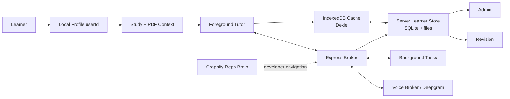

<div align="center">

  <h1>Tutor: Cognitive Learning Interface</h1>

  <p><strong>A local-first learning system for PDFs, source-aware tutoring, voice mode, learner memory, revision, and inspectable AI workflows.</strong></p>

  <picture>
    <source media="(prefers-color-scheme: dark)" srcset="public/banner.png">
    
  </picture>

  <p>
    <a href="https://tutor-system-architecture.vercel.app/">
      
    </a>
  </p>

  <p>
    <a href="https://github.com/MohamedFuad16/Tutor-System/blob/main/LICENSE">
      
    </a>
    <a href="https://react.dev/">
      
    </a>
    <a href="https://www.typescriptlang.org/">
      
    </a>
    <a href="https://vite.dev/">
      
    </a>
    <a href="https://tailwindcss.com/">
      
    </a>
  </p>

  <p>
    <a href="#overview">Overview</a> -
    <a href="#technology-stack">Technology Stack</a> -
    <a href="#core-surfaces">Core Surfaces</a> -
    <a href="#architecture">Architecture</a> -
    <a href="#getting-started">Getting Started</a> -
    <a href="#license">License</a>
  </p>

</div>

---

> [!TIP]
> Tutor supports browser BYOK for local development and explicit server-side
> OpenRouter/Deepgram fallbacks for trusted deployments. Shared server keys stay
> disabled until their matching `ALLOW_SERVER_*_FALLBACK` flag is enabled.

## Overview

Tutor is a local-first study workspace for reading papers and textbooks,
asking a source-aware tutor questions, speaking with a realtime voice tutor, and
turning useful sessions into revision books.

**🔗 Live:** <https://tutor-system-architecture.vercel.app/>

The app is built around one clear product loop:

1. Open a local learner profile.
2. Upload one or more PDFs into a learning book.
3. Ask questions by typed chat or voice.
4. Build a user-scoped context packet from PDFs, selected text, current page,
   prior discussion, semantic memory, and learner state.
5. Answer immediately in the foreground tutor.
6. Delegate slow work to request-correlated background tasks.
7. Store evidence, artifacts, corrections, and revision material for the active
   learner.

The learner brain is not hidden model memory. It is an auditable local system of
records: books, PDFs, concepts, evidence, BKT mastery, artifacts, corrections,
model runs, retrievals, and background jobs. Graphify is separate: it is the
repository architecture graph for developers and agents.

## Technology Stack

| Layer              | Technologies                                                               |
| ------------------ | -------------------------------------------------------------------------- |
| Frontend           | React 19, TypeScript 5.8, Vite 6, Tailwind CSS 4                           |
| State              | Zustand for app state, Dexie over IndexedDB for browser cache/offline rows |
| PDF and documents  | `react-pdf`, PDF.js worker, Python extraction helpers, PyMuPDF4LLM flow    |
| Rich output        | React Markdown, Mermaid, Shiki, KaTeX, Recharts                            |
| Backend            | Node.js, Express, Server-Sent Events, WebSocket routes                     |
| Learner store      | Per-user local folders, SQLite, document/extracted-text/artifact files     |
| AI routes          | OpenRouter-compatible chat/vision routes, tool contracts, background jobs  |
| Voice              | Deepgram STT/TTS duplex broker, plus an OpenAI Realtime test path          |
| Search             | Serper for explicit web/freshness requests                                 |
| Architecture graph | Graphify artifacts in `graphify-out/`                                      |

<p>
  
  
  
  
  
  
</p>

## Core Surfaces

<table width="100%">
  <tr>
    <td width="50%" valign="top">
      <h3>Study Workspace</h3>
      <p>Interactive multi-PDF study surface using <code>react-pdf</code>. Desktop keeps the reader and tutor side by side; mobile opens chat first and treats PDFs as attached context until the learner chooses to view the page.</p>
    </td>
    <td width="50%" valign="top">
      <h3>Streaming Chat Panel</h3>
      <p>SSE tutor responses with Markdown, Mermaid diagrams, code rendering, TTS read-aloud, source-aware prompt context, and one persistent conversation thread per learning book.</p>
    </td>
  </tr>
  <tr>
    <td width="50%" valign="top">
      <h3>Voice Mode</h3>
      <p>A Deepgram full-duplex session where a fast interaction tutor keeps the conversation moving while a smarter background model handles slow work. An OpenAI Realtime path is available for comparison testing.</p>
    </td>
    <td width="50%" valign="top">
      <h3>Learner Brain</h3>
      <p>User-scoped memory for books, PDFs, concepts, semantic context, BKT evidence, mastery deltas, artifacts, and corrections.</p>
    </td>
  </tr>
  <tr>
    <td width="50%" valign="top">
      <h3>Revision Library</h3>
      <p>Paper-style generated learning books, built-in architecture books, active recall, flashcards, code blocks, diagrams, and title-matched stored audio guides.</p>
    </td>
    <td width="50%" valign="top">
      <h3>Admin Diagnostics</h3>
      <p>Inspect request timelines, model runs, tool jobs, memory/retrieval injections, voice events, evidence rows, artifacts, corrections, and readiness checks.</p>
    </td>
  </tr>
</table>

## Architecture



The learner brain is scoped by `userId`. Durable learner data lives under:

```text
data/users/<userId>/
  brain.sqlite
  documents/
  extracted-text/
  artifacts/
  exports/
```

IndexedDB is the browser's built-in structured storage system. Tutor uses Dexie
to work with it. In this repo, IndexedDB is a cache and UI-state layer: metadata,
small previews, active document state, and non-destructive migration fallback.
It is not the durable owner of full PDFs or full extracted text.

SQLite is the local server database file for durable learner rows. The app keeps
`user_id` on rows even inside each per-user database so the same shape can move
to cloud Postgres/object storage later.

## Learner Brain Rules

- Local profiles provide stable user IDs; they are not production cloud auth.
- Chat and voice share `src/memory/brain.context.ts` for user-scoped context
  packets.
- PDF files and extracted text are stored server-side; browser rows keep cache
  metadata and previews.
- Model summaries, transcripts, tool results, and artifacts are teaching/audit
  context only.
- BKT mastery changes require validated evidence such as evaluated answers or
  flashcard reviews linked to real concepts.
- Background tasks are request-correlated so Admin can follow one user action
  across chat, voice, tools, retrieval, artifacts, and memory writes.

## Voice Modes

Voice mode is a **runtime setting** in Settings (no rebuild required):

- **`deepgram-duplex` (default)** — the two-model "interaction" mimic of
  Thinking Machines' interaction models. A fast **Voice foreground model** (the
  "interaction tutor") keeps the live conversation moving via Deepgram STT/TTS
  while an async **Background smart model** does web/code/PDF/reasoning heavy
  lifting, whose result is stitched back in as a spoken aside. Both models plus
  the everyday **Chat model** are chosen from three selectors in Settings and
  share one **OpenRouter key**. To use it on a real deployment, host the
  WebSocket server on a VM — see
  [Azure voice server](./docs/azure-voice-server.md) and the turnkey artifacts
  in [`deploy/`](./deploy) (`Dockerfile`, `Caddyfile`, systemd unit,
  `deploy.sh`).
- **`openai-realtime` (test / comparison only)** — connects the browser
  straight to OpenAI's Realtime API over **WebRTC**, for a true full-duplex,
  uninterrupted benchmark against the cheaper mimic. It needs **no persistent
  server** (only a tiny `/api/realtime/token` endpoint that also runs on Vercel
  serverless) and is BYOK-first (the browser's OpenAI key mints a short-lived
  ephemeral secret; the standard key never reaches the WebRTC exchange). This is
  intentionally **not** the default and is billed at premium realtime rates.

- The chat panel can also delegate heavy sub-tasks to the Background smart model
  via a `delegate_to_background` tool, mirroring the voice split.
- Background answers are cleaned before insertion so raw markdown such as
  `**Apple**` is not read aloud.
- No route should claim a universal sub-200 ms guarantee. Report latency as
  measured p50, p95, failure rate, route, provider, region, and hardware.
- Deployments that terminate the voice WebSocket behind a proxy must strip any
  inbound `X-Forwarded-Host` header so the same-origin broker check can't be
  spoofed.

## Models

Three model selectors in Settings share one OpenRouter key:

| Selector               | Role                                                                             | Default                      |
| ---------------------- | -------------------------------------------------------------------------------- | ---------------------------- |
| Chat model             | The everyday typed-study model.                                                  | `deepseek/deepseek-v4-flash` |
| Voice foreground model | The "interaction tutor" that holds the live spoken conversation. Keep it fast.   | `deepseek/deepseek-v4-flash` |
| Background smart model | The stronger model both surfaces delegate heavy reasoning, web, and PDF work to. | `openai/gpt-5.5`             |

Typed chat reaches the background model through a `delegate_to_background` tool,
so the two-model split is not voice-only. The `VOICE_FOREGROUND_MODEL` and
`VOICE_BACKGROUND_MODEL` environment variables are the server-side defaults used
when a session does not supply its own selection.

## Getting Started

Requirements:

- Node.js 22
- npm
- Python 3 for document extraction helpers
- Optional provider keys: OpenRouter, Deepgram, Serper

Install dependencies:

```bash
npm ci
pip install -r requirements.txt
```

Create `.env` from `.env.example` and fill only the providers you need.

Run locally:

```bash
npm run dev
```

If port `3000` is busy:

```bash
npm run dev -- --host 127.0.0.1 --port 3100
```

## Environment

| Variable                           | Purpose                                                                                         |
| ---------------------------------- | ----------------------------------------------------------------------------------------------- |
| `OPENROUTER_API_KEY`               | Server-side OpenRouter key for chat and custom voice broker when fallback is enabled.           |
| `ALLOW_SERVER_OPENROUTER_FALLBACK` | Must be `true` before browser requests may use the server OpenRouter key.                       |
| `DEEPGRAM_API_KEY`                 | Deepgram STT/TTS key.                                                                           |
| `ALLOW_SERVER_DEEPGRAM_FALLBACK`   | Must be `true` before browser requests may use the server Deepgram key.                         |
| `SERPER_API_KEY`                   | Legacy typed-chat web search key. Custom voice background search uses OpenRouter tools instead. |
| `VOICE_FOREGROUND_MODEL`           | Server default for the voice interaction tutor; the Settings selector overrides it per session. |
| `VOICE_BACKGROUND_MODEL`           | Server default for the background smart model; the Settings selector overrides it per session.  |
| `VOICE_BROKER_STT_MODEL`           | Deepgram STT model, default `nova-3`.                                                           |
| `VOICE_BROKER_TTS_MODEL`           | Deepgram Aura TTS model.                                                                        |
| `VITE_VOICE_WS_URL`                | Voice server URL (e.g. `wss://voice.example.com`) when the app host cannot serve WebSockets.    |
| `VOICE_ALLOWED_ORIGINS`            | On the voice server: web app origins allowed to open cross-origin voice WebSockets.             |

## Architecture Docs

- [System architecture](./TUTOR_ARCHITECTURE.md)
- [Learner brain architecture](./docs/learner-brain-architecture.md)
- [Agent workflow instructions](./AGENTS.md)

## Graphify Workflow

Use Graphify before broad code reads:

```bash
graphify query "how does the voice broker connect to ChatPanel?" --budget 2000 --graph graphify-out/graph.json
graphify path "ChatPanel" "server.ts" --graph graphify-out/graph.json
npm run graphify:tree
```

Do not regenerate `graphify-out` automatically after ordinary edits. Refresh
Graphify artifacts only when graph maintenance is explicitly requested.

## Verification

Run the complete local gate before pushing:

```bash
npm run format:check
npm run lint
npm test
npm run build
npm run brain:postchange -- --reason readme-update
```

For UI changes, also open the running app in the browser and smoke-test Study,
fullscreen chat, Revision, and Admin at desktop and mobile widths.

## Local-Beta Boundaries

- Local profiles provide stable user IDs, but they are not real cloud
  authentication.
- Durable local learner records live in server folders and SQLite. Production
  tenancy, backups, retention, and organization administration are deferred.
- IndexedDB is still used for local cache/UI state and non-destructive migration
  fallback, but it should not be treated as the durable source for full PDFs or
  full extracted text.
- Voice provider combinations need measured real-key proof before any latency
  promise is made.
- Citation and artifact checks record provenance and local consistency; they do
  not prove every generated claim is factually true.

## License

This project is licensed under the [MIT License](./LICENSE).
